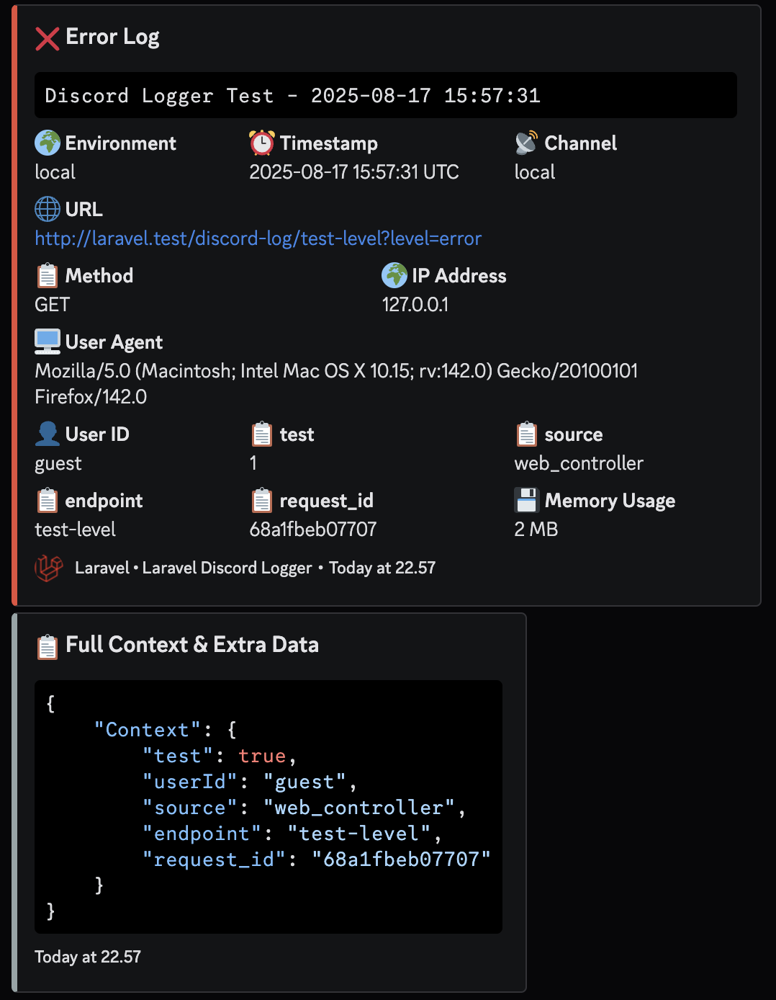
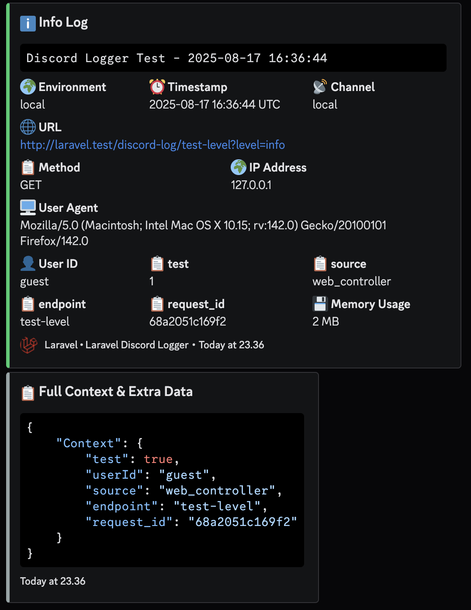
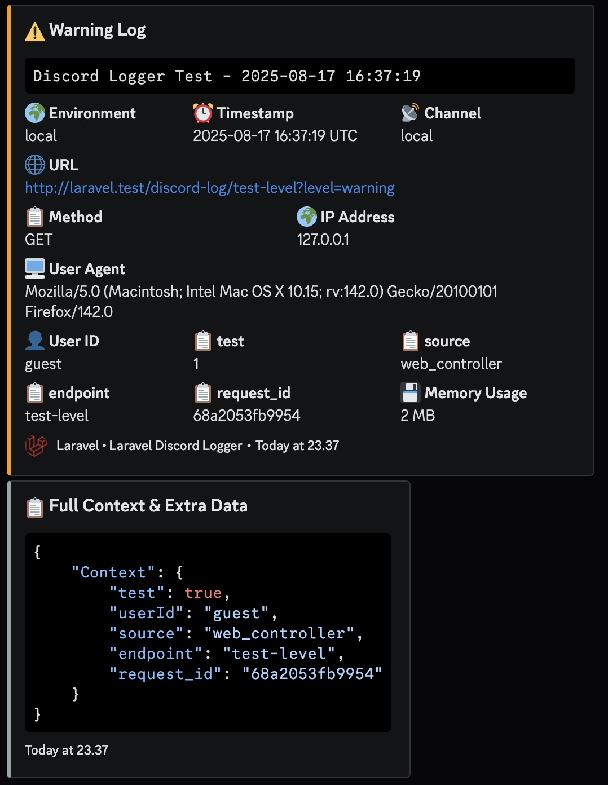

# Laravel Discord Logger Channel

A powerful Discord-based Monolog driver for Laravel that sends rich, detailed log messages to Discord channels via webhooks.

## 🚀 Requirements

-   **PHP**: ^7.2.5 | ^8.0
-   **Laravel**: ^7.0 | ^8.0 | ^9.0 | ^10.0 | ^11.0 | ^12.0
-   **GuzzleHttp**: ^7.0
-   **Discord**: Webhook URL with appropriate permissions

## ✨ Features

### 🚀 Core Features

-   **Easy Installation**: One-command setup with auto-configuration
-   **Multiple Log Levels**: Complete support for all Monolog levels with color coding
-   **Environment Control**: Smart environment-based logging activation
-   **Rich Context**: Comprehensive information collection and formatting
-   **Professional UI**: Beautiful Discord embeds with emojis and color coding

### 🔧 Advanced Features

-   **Built-in Commands**: Status check, testing, and installation commands
-   **Web Interface**: Interactive testing panel with real-time results
-   **API Routes**: RESTful endpoints for programmatic testing
-   **Exception Handling**: Detailed exception information with stack traces
-   **Request Tracking**: Complete HTTP request information capture
-   **User Context**: Automatic user identification and tracking
-   **Memory Monitoring**: System resource usage tracking
-   **Smart Formatting**: Automatic JSON formatting for complex data

### 🛡️ Enterprise Ready

-   **Robust Error Handling**: Silent failure mode prevents app crashes
-   **Performance Optimized**: Field limits and efficient data processing
-   **Security Features**: Sensitive data filtering and path sanitization
-   **Configurable Limits**: Customizable field and message length limits

## Installation

### Via Composer

```bash
composer require renslabs/laravel-logger-discord-channel
```

### Auto-Configuration

Run the install command to automatically configure the package:

```bash
php artisan logger:discord-install
```

This will:

-   Add Discord channel configuration to `config/logging.php`
-   Add environment variables to `.env`
-   Show next steps for setup

### Manual Configuration

If you prefer manual setup, add this to your `config/logging.php` channels array:

```php
'discord' => [
    'driver' => 'custom',
    'via' => \renslabs\LoggerDiscordChannel\DiscordLogger::class,
    'level' => env('DISCORD_LOG_LEVEL', 'debug'),
    'webhook' => env('DISCORD_WEBHOOK_URL'),
    'message' => env('DISCORD_MESSAGE', null),
    'context' => env('DISCORD_INCLUDE_CONTEXT', false),
    'suffix' => env('DISCORD_LOG_SUFFIX', config('app.name')),
    'environment' => ['production', 'staging', 'local'],
    'max_field_length' => env('DISCORD_MAX_FIELD_LENGTH', 1024),
    'max_description_length' => env('DISCORD_MAX_DESCRIPTION_LENGTH', 4000),
],
```

Add these environment variables to your `.env` file:

```env
# Basic Configuration
DISCORD_WEBHOOK_URL=https://discord.com/api/webhooks/YOUR_WEBHOOK_URL
DISCORD_LOG_LEVEL=info
DISCORD_INCLUDE_CONTEXT=true
DISCORD_MAX_FIELD_LENGTH=1024
DISCORD_MAX_DESCRIPTION_LENGTH=4000
```

## 🚀 Usage

### Environment Configuration

#### Laravel 11+ Configuration

For Laravel 11 and above, simply update your `.env` file:

```env
# Enable stack logging with multiple channels
LOG_CHANNEL=stack
LOG_STACK=single,discord

# Discord Configuration
DISCORD_WEBHOOK_URL=https://discord.com/api/webhooks/YOUR_WEBHOOK_URL
DISCORD_LOG_LEVEL=info
DISCORD_INCLUDE_CONTEXT=true
DISCORD_MAX_FIELD_LENGTH=1024
DISCORD_MAX_DESCRIPTION_LENGTH=4000
```

#### Laravel 10 and Below Configuration

For Laravel 10 and below, you need to update both your `config/logging.php` and `.env` files:

**1. Update `config/logging.php`:**

```php
'channels' => [
    'stack' => [
        'driver' => 'stack',
        'channels' => ['single', 'discord'],
        'ignore_exceptions' => false,
    ],

    // ... other channels

    'discord' => [
        'driver' => 'custom',
        'via' => \renslabs\LoggerDiscordChannel\DiscordLogger::class,
        'level' => env('DISCORD_LOG_LEVEL', 'debug'),
        'webhook' => env('DISCORD_WEBHOOK_URL'),
        'message' => env('DISCORD_MESSAGE', null),
        'context' => env('DISCORD_INCLUDE_CONTEXT', false),
        'suffix' => env('DISCORD_LOG_SUFFIX', config('app.name')),
        'environment' => ['production', 'staging', 'local'],
        'max_field_length' => env('DISCORD_MAX_FIELD_LENGTH', 1024),
        'max_description_length' => env('DISCORD_MAX_DESCRIPTION_LENGTH', 4000),
    ],
],
```

**2. Update your `.env` file:**

```env
# Use stack logging
LOG_CHANNEL=stack

# Discord Configuration
DISCORD_WEBHOOK_URL=https://discord.com/api/webhooks/YOUR_WEBHOOK_URL
DISCORD_LOG_LEVEL=info
DISCORD_INCLUDE_CONTEXT=true
DISCORD_MAX_FIELD_LENGTH=1024
DISCORD_MAX_DESCRIPTION_LENGTH=4000
```

### Basic Usage

```php
use Illuminate\Support\Facades\Log;

// Simple error logging
Log::error('Payment processing failed', [
    'userId' => auth()->id(),
    'amount' => 99.99,
    'payment_method' => 'credit_card'
]);

// Info with rich context
Log::info('User registered successfully', [
    'userId' => $user->id,
    'email' => $user->email,
    'source' => 'web_registration',
    'metadata' => [
        'referrer' => request()->header('referer'),
        'ip' => request()->ip()
    ]
]);

// Exception with full context
try {
    $this->processPayment($request);
} catch (Exception $e) {
    Log::critical('Payment system failure', [
        'exception' => $e,
        'userId' => auth()->id(),
        'request_data' => $request->except(['password', 'card_number']),
        'system_load' => sys_getloadavg()[0]
    ]);
}
```

## 🔧 Available Commands

### Installation & Setup

```bash
php artisan logger:discord-install          # Auto-configure package
php artisan logger:discord-install --force  # Overwrite existing config
```

### Status & Diagnostics

```bash
php artisan logger:discord-status           # Comprehensive status check
```

**Checks:**

-   ✅ Package installation and class loading
-   ⚙️ Configuration validation
-   🌐 Webhook connectivity testing
-   🌍 Environment settings verification
-   💾 Memory and system information

### Testing & Validation

```bash
php artisan logger:discord-test                    # Test with default level (info)
php artisan logger:discord-test --level=error      # Test error level
php artisan logger:discord-test --level=warning    # Test warning level
php artisan logger:discord-test --level=info       # Test info level
```

## ⚙️ Configuration Options

### Basic Configuration

| Option        | Description                          | Default                              | Example                                |
| ------------- | ------------------------------------ | ------------------------------------ | -------------------------------------- |
| `level`       | Minimum log level to send            | `debug`                              | `error`, `warning`, `info`             |
| `webhook`     | Discord webhook URL                  | Required                             | `https://discord.com/api/webhooks/...` |
| `message`     | Custom message prefix                | `null`                               | `"🚨 Alert from MyApp"`                |
| `context`     | Include full context/stacktrace      | `false`                              | `true`, `false`                        |
| `suffix`      | Suffix for log title                 | App name                             | `"Production Server"`                  |
| `environment` | Environments where logging is active | `['production', 'staging', 'local']` | `['production']`                       |

### Advanced Configuration

| Option                   | Description                        | Default | Purpose            |
| ------------------------ | ---------------------------------- | ------- | ------------------ |
| `max_field_length`       | Maximum Discord field value length | `1024`  | Prevent API errors |
| `max_description_length` | Maximum embed description length   | `4000`  | Discord API limit  |

## 📊 Log Levels & Visual Design

### Supported Log Levels

| Level       | Priority | Emoji | Color      | Use Case                  |
| ----------- | -------- | ----- | ---------- | ------------------------- |
| `emergency` | 600      | 🚨    | Dark Red   | System unusable           |
| `alert`     | 550      | 🔴    | Red        | Immediate action required |
| `critical`  | 500      | 💥    | Orange Red | Critical conditions       |
| `error`     | 400      | ❌    | Red        | Runtime errors            |
| `warning`   | 300      | ⚠️    | Orange     | Exceptional occurrences   |
| `notice`    | 250      | 🔔    | Blue       | Normal but significant    |
| `info`      | 200      | ℹ️    | Green      | Interesting events        |
| `debug`     | 100      | 🔍    | Gray       | Detailed debug info       |

**Important**: Only logs at or above the configured level will be sent to Discord.

## 📱 Rich Discord Message Format

### Main Embed Structure

-   **Professional Title**: Emoji + Log Level + App Name
-   **Color-Coded**: Different colors for each log level
-   **Structured Fields**: Organized information display
-   **Timestamp**: ISO 8601 format with timezone
-   **Footer**: App branding with Laravel logo

### Comprehensive Information Capture

#### 🌍 System Information

-   Environment (local/staging/production)
-   Memory usage (formatted)
-   Log channel name
-   Timestamp with timezone

#### 🌐 Request Information (Web Requests)

-   Full URL with parameters
-   HTTP method (GET, POST, etc.)
-   Client IP address
-   User agent string
-   Referer header

#### 👤 User Context

-   Custom user ID from context
-   Authenticated user (ID + email)
-   Session information

#### 💥 Exception Details

-   Exception class name
-   File path and line number (sanitized)
-   Exception code
-   Previous exception chain
-   Stack trace (if context enabled)

#### 📋 Custom Context

-   All context data with smart formatting
-   JSON formatting for complex objects
-   Automatic field organization
-   Length limits for Discord compatibility

### Context Embed (Optional)

When `context` is enabled, a separate embed shows:

-   Complete context data
-   Extra Monolog fields
-   JSON formatted for readability
-   Proper syntax highlighting

## 🌍 Best Practices

### Recommended Settings by Environment

#### Production

```env
DISCORD_LOG_LEVEL=error
DISCORD_INCLUDE_CONTEXT=false
DISCORD_MAX_FIELD_LENGTH=512
```

#### Staging

```env
DISCORD_LOG_LEVEL=warning
DISCORD_INCLUDE_CONTEXT=true
DISCORD_MAX_FIELD_LENGTH=1024
```

#### Development

```env
DISCORD_LOG_LEVEL=debug
DISCORD_INCLUDE_CONTEXT=true
DISCORD_MAX_FIELD_LENGTH=1024
```

## 🛡️ Security & Performance

### Security Features

-   ✅ **Path Sanitization**: Base path stripped from file paths
-   ✅ **Length Limits**: Prevent Discord API overflow
-   ✅ **Silent Failure**: Won't crash your application
-   ✅ **Timeout Protection**: 10-second HTTP timeout
-   ✅ **Sensitive Data**: Easy to exclude sensitive fields

### Performance Optimizations

-   ✅ **Field Limits**: Maximum 25 fields per embed
-   ✅ **Efficient Processing**: Optimized data extraction
-   ✅ **Memory Tracking**: Built-in memory usage monitoring
-   ✅ **Non-blocking**: Asynchronous HTTP requests
-   ✅ **Smart Formatting**: Automatic data type handling

### Rate Limiting Considerations

Discord webhooks have rate limits:

-   **5 requests per 2 seconds** per webhook
-   **30 requests per minute** per webhook

For high-traffic applications, consider:

-   Using higher log levels in production
-   Implementing custom rate limiting
-   Using multiple webhooks for different log levels

## 🔧 Troubleshooting

### Installation Issues

```bash
# Regenerate autoload files
composer dump-autoload

# Discover packages
php artisan package:discover

# Clear configuration cache
php artisan config:clear
```

### Configuration Issues

```bash
# Check package status
php artisan logger:discord-status

# Test configuration
php artisan logger:discord-test --level=error
```

### Webhook Issues

-   ✅ Verify webhook URL format and validity
-   ✅ Check Discord server permissions
-   ✅ Test connectivity: `php artisan logger:discord-status`
-   ✅ Verify webhook hasn't been deleted or regenerated

### Logs Not Appearing

-   ✅ Check environment configuration matches current env
-   ✅ Verify log level settings (debug < info < warning < error)
-   ✅ Run comprehensive diagnosis: `php artisan logger:discord-status`
-   ✅ Check Discord channel for rate limiting messages

### Performance Issues

-   ✅ Reduce log level in production (use `error` instead of `debug`)
-   ✅ Disable context in high-traffic environments
-   ✅ Implement application-level rate limiting
-   ✅ Monitor memory usage with built-in tracking

## 📋 Example Discord Message

Here's what your logs will look like in Discord:





## 📄 License

MIT License. See [LICENSE.md](LICENSE.md) for details.

**Made with ❤️ for the Laravel community**
